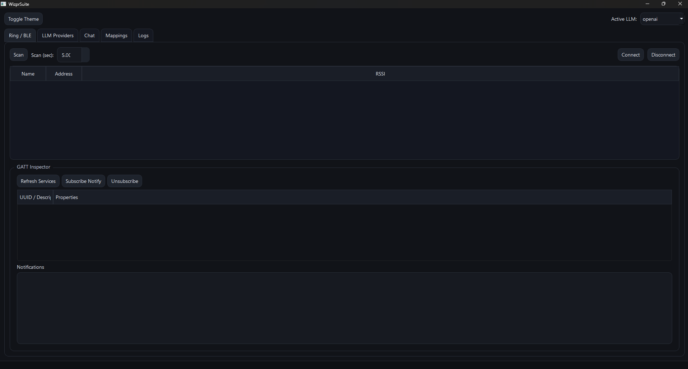

<p align="center">
  
</p>

<p align="center">
  <b>BLE wearable control plane + multi-LLM desktop suite (Windows-first)</b><br/>
  Turn ring button / proximity / voice events into actions across OpenAI, Ollama, and local LLM servers.
</p>

# Wizpr Suite

[](#installation)


**Wizpr Suite** is a polished desktop application that connects to a BLE wearable (e.g., Wizpr Ring) and routes device events (button presses, proximity triggers, voice commits) into a configurable toolkit for **LLM workflows**.

The ring protocol is not public (and may vary by firmware). This project is built for rapid integration anyway:
- Robust BLE scanning + connection
- **GATT inspector** (services/characteristics)
- User-mapped characteristic UUIDs
- High-signal event stream and action routing
- Multi-provider LLM support (cloud + local)
- Optional remote API for “use it from anywhere” via secure tunneling

---

## Table of Contents

1. [Key Features](#key-features)
2. [Architecture](#architecture)
3. [Quick Start](#quick-start)
4. [Installation](#installation)
5. [Using the App](#using-the-app)

   * [Connect a Ring (BLE)](#connect-a-ring-ble)
   * [Map Ring Events → Actions](#map-ring-events--actions)
   * [Chat + Voice](#chat--voice)
6. [LLM Providers](#llm-providers)
7. [Plugins](#plugins)
8. [Remote Access (Optional)](#remote-access-optional)
9. [Project Structure](#project-structure)
10. [Security Notes](#security-notes)
11. [Roadmap](#roadmap)
12. [License](#license)

---

## Key Features

### BLE wearable integration (Windows-first)

* BLE scan, connect, disconnect
* **Inspect GATT** (services/characteristics, properties)
* Subscribe to notifications on chosen characteristics
* Emits semantic events

* Emits raw diagnostics:

  * `raw_notify` (hex payloads for reverse-engineering and mapping)

### Multi-LLM control plane

* **OpenAI (Responses API)** (via `openai` SDK)
* **Ollama** (local)
* **OpenAI-compatible servers** (llama.cpp server, LM Studio, etc.)
* Configurable temperature + endpoint style

### Desktop UX that scales

* Dark + light themes (QSS styling)
* Central logging view + rotating log files
* Clean separation between BLE, routing, LLM providers, UI

### Remote “from anywhere” (optional)

* Local FastAPI remote endpoint (`/chat`, `/event`, `/health`)
* Designed to be exposed via secure tunnels (Tailscale / Cloudflare Tunnel), not raw port-forwarding

---

## Architecture

**High-level flow**

1. **Ring** (BLE device) emits notifications
2. **BLE Manager** scans/connects and subscribes to characteristics
3. **Ring Controller** interprets button pulses → semantic events
4. **EventBus** distributes events to the application
5. **ActionRouter** maps events → actions (configurable)
6. **LLM Providers** execute chat calls (OpenAI / Ollama / local server)
7. **UI** shows status, chat, logs; optional **Remote API** mirrors key entrypoints

```text
BLE Wearable → Bleak → RingController → EventBus → ActionRouter → Actions
                                                     ├─ UI updates
                                                     ├─ LLM provider calls
                                                     └─ Remote API events
```

---

## Quick Start

```bash
python -m venv .venv
.venv\Scripts\activate
pip install -U pip
pip install -r requirements.txt
python -m wizpr_suite.app
```

---

## Installation

### Requirements

* Windows 10/11 with Bluetooth enabled and functional drivers
* Python **3.10+** recommended
* Optional for voice features:

  * Microphone input device
  * OpenAI API access for transcription (can be replaced later)

### Dependencies

Install from `requirements.txt`:

```bash
pip install -r requirements.txt
```

---

## Using the App

### Connect a Ring (BLE)

1. Open **Devices** tab
2. Click **Scan**
3. Select your device and click **Connect**
4. Click **Inspect GATT**
5. Copy/paste the relevant characteristic UUIDs into the **Device Profile** fields:

   * **Button notify UUID** (required for button events)
   * Audio / text UUIDs (optional, device dependent)
6. Click **Save Profile**

> Some devices require pairing/bonding first. Pair the ring in Windows Bluetooth settings if read/notify fails.

### Map Ring Events → Actions

Go to **Commands** tab and choose what each ring event does:

* `button_single` → `toggle_listen`
* `button_double` → `send_last_transcript`
* `button_triple` → `cycle_llm`
* `button_long` → `noop` (or another action)

Mappings are stored in:

* `%APPDATA%\WizprSuite\config.json` (Windows)

### Chat + Voice

* **Chat** tab:

  * type a message and press Enter
  * results are sent to the active provider
* **Start Listening (Mic)**:

  * records short 4s chunks
  * transcribes (OpenAI STT by default)
  * stores the latest transcript
* **Send Last Transcript**:

  * injects the transcript into chat and sends it

---

## LLM Providers

### OpenAI (Responses API)

Configure in the **Models** tab (recommended), or via environment variable:

```bash
set WIZPR_OPENAI_API_KEY=your_key_here
```

### Ollama (local)

* Install Ollama and run it
* Default base URL: `http://127.0.0.1:11434`
* Choose a model (example: `llama3.2`)

### OpenAI-Compatible Servers (llama.cpp server / LM Studio / etc.)

* Set base URL (example: `http://127.0.0.1:8080`)
* Choose endpoint style:

  * `/v1/chat/completions` **or**
  * `/v1/responses`

---

## Plugins

Drop a provider plugin into:

* Windows: `%APPDATA%\WizprSuite\plugins\`
* Linux/macOS: `~/.wizpr_suite/plugins/`

Each plugin is a single `.py` with a `register(registry)` function.

Example is included:

* `wizpr_suite/plugins/example_provider.py`

Minimal template:

```python
from dataclasses import dataclass
from typing import Dict, List
from wizpr_suite.llm.providers.base import LLMProvider, LLMResponse

@dataclass
class MyProvider(LLMProvider):
    id: str = "my_provider"
    name: str = "My Provider"

    async def health(self) -> bool:
        return True

    async def chat(self, messages: List[Dict[str, str]], *, temperature=None) -> LLMResponse:
        return LLMResponse(text="hello", raw={})

def register(registry):
    registry.register(MyProvider())
```

---

## Remote Access (Optional)

Run the remote server:

```bash
python -m wizpr_suite.server --host 127.0.0.1 --port 8844 --token YOUR_TOKEN
```

Then expose it safely with a tunnel (recommended):

* Tailscale
* Cloudflare Tunnel
* WireGuard

**Do not** open the port to the internet without strict controls.

---

## Project Structure

```text
wizpr_suite/
├─ wizpr_suite/
│  ├─ app/                 # entrypoints
│  ├─ ble/                 # BLE scanning, connection, ring controller
│  ├─ core/                # config, event bus, action routing, app state
│  ├─ llm/                 # provider registry + implementations
│  ├─ audio/               # mic recording + transcription
│  ├─ server/              # optional FastAPI remote API
│  ├─ ui/                  # PySide6 main window + widgets + themes
│  ├─ plugins/             # example plugin provider
│  └─ resources/           # QSS themes
├─ tests/
└─ requirements.txt
```

---

## Security Notes

* Treat the **remote API token** as a secret.
* Prefer **local binding** (`127.0.0.1`) + a secure tunnel over direct exposure.
* BLE payload logging may include sensitive content depending on device behavior. Be mindful when sharing logs.

---

## Roadmap

* Ring audio ingestion (if device streams audio over BLE) with:

  * framing/chunk reassembly
  * codec detection (PCM/ADPCM/etc.)
  * on-device transcript decode (if supported)
* Proximity sensor event mapping (if device exposes it over BLE)
* Macro/action engine:

  * app-level “workflows” (e.g., “summarize clipboard → send to LLM → paste back”)
  * hotkeys + system tray mode
* More providers (Anthropic, Groq, local gRPC, etc.)
* Linux support hardening

---

## License

**MIT**.

---

### Disclaimer

This project is not associated with Wizpr ring. This project is intended for interoperability and user-controlled workflows. Device protocols and capabilities vary; use responsibly and respect vendor terms and privacy.
