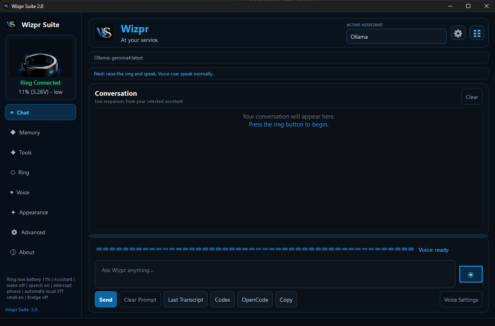

<div align="center">
  

  <h1>Wizpr Suite 2.0</h1>

  <p>
    <strong>A Windows-based control suite for the Wizpr Ring.</strong>
  </p>

  <p>
    Capture voice directly from the ring, communicate with local or remote AI models,
    maintain persistent memory, use approved desktop tools, and connect through a phone gateway.
  </p>
</div>

<p align="center">
  <a href="#installation">
    
  </a>
  
  
  
  
  
  
</p>

---

## Current Release

After receiving my Wizpr Ring, I was finally able to properly test the hardware, reverse-engineer its Bluetooth communication layer, and replace the temporary assumptions I had been working around before the device was physically available.

This allowed me to integrate the correct BLE characteristics, audio handling, packet reconstruction, recording flow, connection behavior, button events, and device backends directly into Wizpr Suite.

Wizpr Suite is now a complete Windows-based control and AI interface for the ring rather than a basic companion application. It can capture voice from the ring, transcribe it, route the request to a selected AI backend, stream the response, speak it back, remember previous information, and optionally perform approved desktop actions.

---

<div align="center">
  
</div>

## Key Features

### Wizpr Ring Integration

- BLE scanning and device discovery
- Automatic connection and reconnection
- Persistent connected status
- Protection against button events that would lock or disconnect an active ring
- GATT service and characteristic inspection
- Characteristic UUID mapping
- BLE notification subscriptions
- Button and proximity event handling
- Direct ring-audio ingestion
- ADPCM packet reconstruction
- Duplicate-packet rejection
- Out-of-order packet correction
- Silent-activation rejection
- False-trigger suppression
- Configurable activation sensitivity and cooldown behavior
- Raw BLE diagnostics for protocol research and troubleshooting

### Voice Assistant

- Voice capture directly from the ring
- Local and cloud speech-to-text
- Streaming AI responses
- Windows text-to-speech
- Configurable voice interruption
- State-aware `stop` command
- Background-noise and silence filtering
- Transcription hallucination filtering
- Protection against stale or overlapping responses
- Latest-request-wins conversation handling

The word `stop` only acts as an interruption while Wizpr is actively generating or speaking. At all other times, it remains part of normal speech.

### AI Providers

Wizpr Suite supports several model and agent backends:

- OpenAI
- Ollama
- OpenAI-compatible local servers
- Custom IP-hosted AI servers
- Codex
- OpenCode
- Additional providers through the plugin system

Compatible local servers can include:

- llama.cpp server
- LM Studio
- vLLM
- LocalAI
- Other OpenAI-compatible APIs

### Persistent Memory

Wizpr Suite can preserve context between conversations and application restarts.

Memory includes:

- Recent conversation history
- Explicit long-term facts
- Configurable history limits
- Memory enable or disable control
- Memory management and deletion tools

Examples:

```text
Remember that my dog likes special scratches under the head.
Forget that I misspelled my own name.
````

Memory is stored locally at:

```text
%APPDATA%\WizprSuite\memory.json
```

### Desktop Tools

Wizpr Suite can perform approved desktop actions through a restricted built-in tool system.

Permission modes:

* **Disabled** — tools cannot run
* **Ask** — each action requires approval
* **Auto-allow** — supported actions run automatically

Supported actions include opening:

* Notepad
* Calculator
* File Explorer
* Windows Settings
* Command Prompt
* PowerShell
* Windows Terminal
* Microsoft Edge
* Google Chrome
* The default browser
* Desktop
* Documents
* Downloads

The built-in desktop tool system uses a fixed allowlist. It does not accept arbitrary shell commands from normal model output.

### Phone Gateway and Remote Access

Wizpr Suite includes a local FastAPI gateway for phone and remote integrations.

Available endpoints include:

* `/chat`
* `/event`
* `/health`

The gateway is designed to be used through a secure private connection such as:

* Tailscale
* Cloudflare Tunnel
* WireGuard
* A trusted local network

Directly exposing the gateway to the public internet is not recommended.

### Desktop Interface

* Redesigned Wizpr Suite 2.0 interface
* Ring connection and battery status
* Conversation-style chat display
* Live listening visualization
* Provider selection
* Dark and light themes
* Voice and speech settings
* Memory management
* Tool-permission controls
* Privacy controls
* BLE diagnostics
* Advanced provider configuration
* Rotating application logs
* Custom WS application icon

---

## Architecture

### High-Level Flow

```text
Wizpr Ring
    │
    ▼
BLE Manager
    │
    ▼
Ring Controller
    │
    ├── Packet ordering
    ├── Duplicate rejection
    ├── ADPCM decoding
    ├── Voice-activity validation
    └── Semantic event generation
    │
    ▼
Event Bus
    │
    ├── Transcription
    ├── Action routing
    ├── Desktop tools
    ├── Memory
    ├── Phone gateway
    └── AI providers
            │
            ▼
    Streaming response
            │
            ├── User interface
            └── Text-to-speech
```

Each voice request receives its own session, transcription request, response-generation ID, and speech-generation ID. Older requests are invalidated when a newer turn begins, preventing mixed conversations and delayed response fragments.

---

## Installation

### Standalone Executable

Download the most recent .exe from the release section on the right.

### Run From Source

Requirements:

* Windows 10 or Windows 11
* Python 3.11
* Bluetooth enabled
* Functional Windows Bluetooth drivers

Create a virtual environment:

```bat
python -m venv .venv
.venv\Scripts\activate
```

Install the dependencies:

```bat
python -m pip install --upgrade pip
pip install -r requirements.txt
```

Start Wizpr Suite:

```bat
python -m wizpr_suite.app
```

---

## Connecting the Ring
First Method -
1. Start Wizpr Suite.
2. Press button on ring for a second or until the light comes on, then release.
3. Wait for Suite to say connected.
4. Save the device profile for automatic reconnection.

Second Method
1. Start Wizpr Suite.
2. Open the device or ring settings.
3. Scan for nearby BLE devices.
4. Select the Wizpr Ring.
5. Connect to the ring.
6. Confirm that the sidebar displays **Ring Connected**.
7. Save the device profile for automatic reconnection.

Some Windows systems may require the ring to be paired through Windows Bluetooth settings before all GATT characteristics can be accessed.

Wizpr Suite attempts to maintain the saved connection and reconnect when the ring becomes available again.

Currently Wizpr Ring uses basic BLE configurations so it can connect to most bluetooth devices.

---

## Voice Configuration

Voice settings include:

* Local, OpenAI, or automatic transcription
* Speech-activity thresholds
* Minimum recording duration
* Activation cooldown
* Silence timeout
* Interrupt behavior
* Interrupt phrases
* Text-to-speech controls
* Audio preprocessing
* Transcription diagnostics

Available interruption modes include:

* Interrupt phrase
* Ring activity
* Phrase or ring
* Disabled

The default standalone interruption word is:

```text
stop
```

It only becomes active while Wizpr is generating or speaking a response.

---

## LLM Configuration

### OpenAI

Configure the API key in Wizpr Suite or through an environment variable:

```bat
set WIZPR_OPENAI_API_KEY=your_key_here
```

### Ollama

Install and start Ollama, then configure the default server:

```text
http://127.0.0.1:11434
```

Example model:

```text
llama3.2
```

### OpenAI-Compatible Servers

Configure the server address, model name, API key if required, and endpoint style.

Example addresses:

```text
http://127.0.0.1:8080
http://192.168.1.100:8000
```

Supported endpoint styles include:

```text
/v1/chat/completions
/v1/responses
```

### Codex and OpenCode

Codex and OpenCode can be selected as assistant backends when their required local tools and authentication are available.

These integrations allow the ring to route requests into coding and agent-based workflows without requiring all work to pass through a cloud chat provider.

---

## Plugin System

Provider plugins can be placed in:

```text
%APPDATA%\WizprSuite\plugins\
```

Each plugin is a Python module containing a `register(registry)` function.

Example:

```python
from dataclasses import dataclass
from typing import Dict, List

from wizpr_suite.llm.providers.base import LLMProvider, LLMResponse

class MyProvider(LLMProvider):
    id: str = "my_provider"
    name: str = "My Provider"

    async def health(self) -> bool:
        return True

    async def chat(
        self,
        messages: List[Dict[str, str]],
        *,
        temperature=None,
    ) -> LLMResponse:
        return LLMResponse(text="Hello from MyProvider.", raw={})

def register(registry):
    registry.register(MyProvider())
```

---

## Remote Gateway

Start the local gateway with:

```bat
python -m wizpr_suite.server --host 127.0.0.1 --port 8844 --token YOUR_TOKEN
```

Use a secure tunnel or private network to access it remotely.

Do not expose the service publicly without authentication, transport security, and appropriate network controls.

---

## Configuration and Local Data

Wizpr Suite stores its local configuration under:

```text
%APPDATA%\WizprSuite\
```

This may include:

```text
config.json
memory.json
logs\
plugins\
```

API keys, local memory, recordings, logs, and user configuration are excluded from the repository through `.gitignore`.

---

## Project Structure

```text
wizpr_suite/
├── app.py
├── ble/
│   ├── manager.py
│   ├── ring_controller.py
│   └── profiles.py
├── core/
│   ├── config.py
│   ├── event_bus.py
│   ├── action_router.py
│   ├── memory.py
│   └── local_transcription.py
├── llm/
│   └── providers/
├── plugins/
├── resources/
├── server/
├── ui/
│   ├── main_window.py
│   ├── settings_window.py
│   └── widgets/
└── audio/

tests/
docs/
build_windows_exe.bat
build_windows_exe.ps1
requirements.txt
```

---

## Security Notes

* Keep remote services bound to `127.0.0.1` unless a secure network configuration is in place.
* Use a private tunnel instead of raw internet port forwarding.
* BLE diagnostics may contain device or voice-related information.
* Review logs before sharing them publicly.
* Desktop tool execution should remain in **Ask** mode unless automatic access is specifically needed.
* Memory can be disabled or cleared through the application settings.

---

## Roadmap

* Expanded phone gateway functionality
* More local and remote model providers
* Additional desktop tools
* Optional offline speech synthesis engines (Expanding into voice generation based on sampling)
* Linux compatibility (V3.0)
* Additional BLE tools

---

## License

Wizpr Suite is released under the **MIT License**.

See [LICENSE](LICENSE) for the complete license text.

---

## Disclaimer

Wizpr Suite is an independent project and is not affiliated with, endorsed by, or officially associated with the manufacturer of the Wizpr Ring.

Device protocols and capabilities may differ between hardware revisions and firmware versions.
